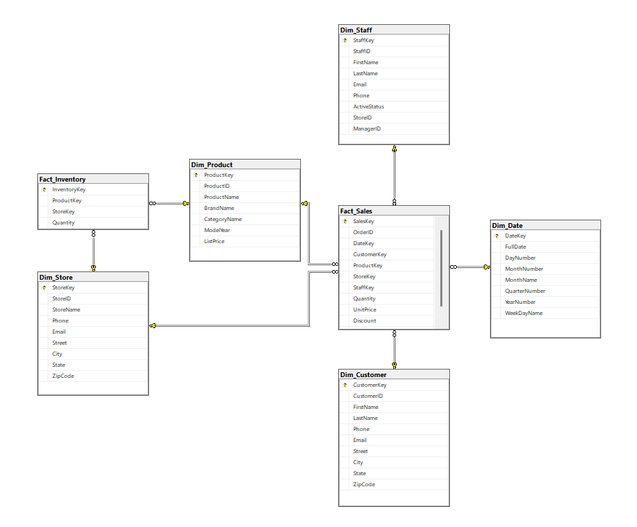
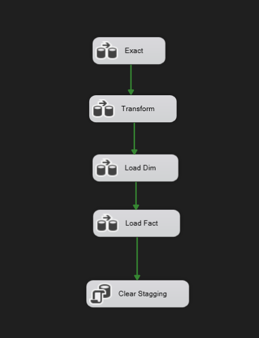
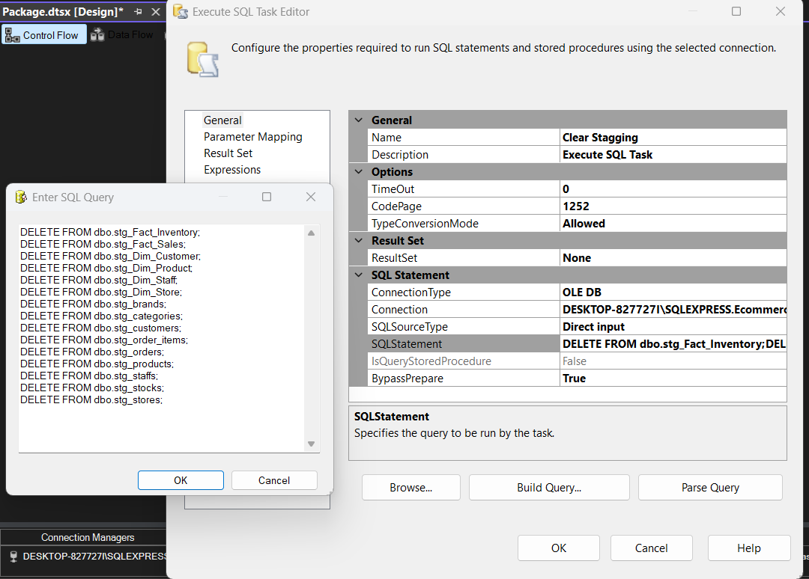
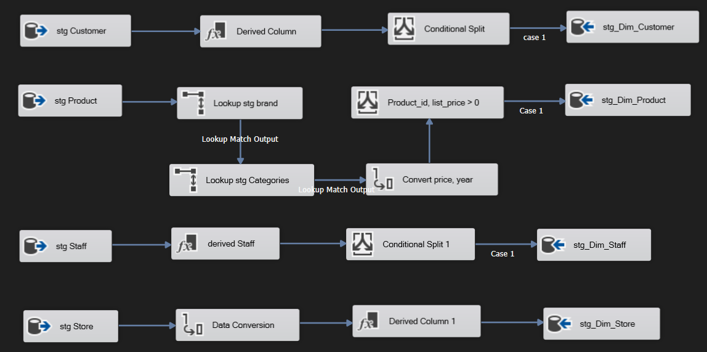
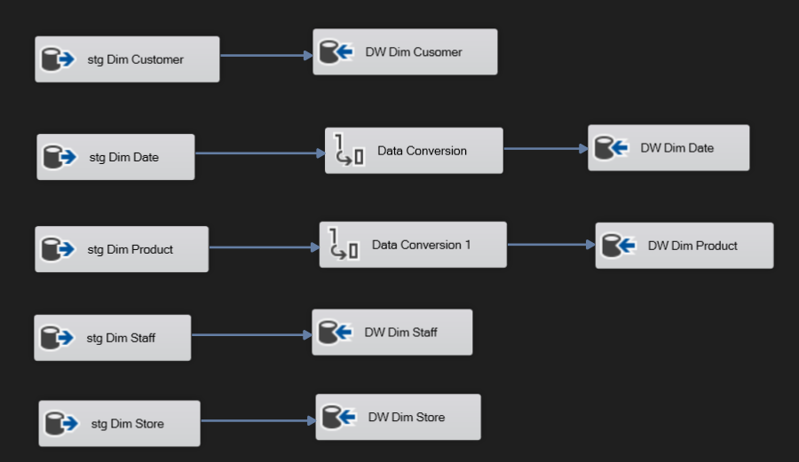
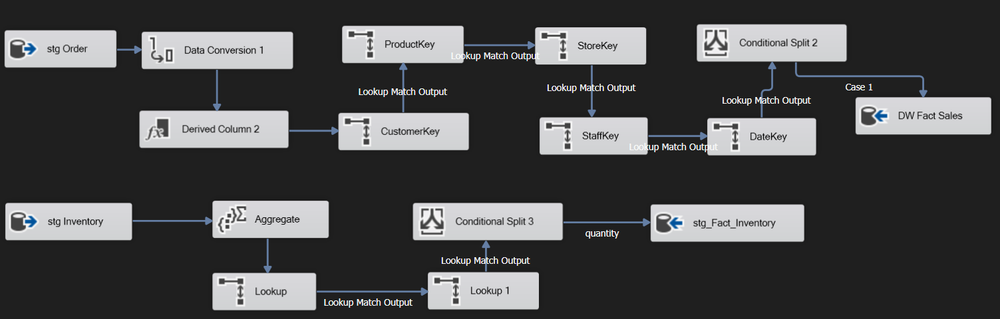
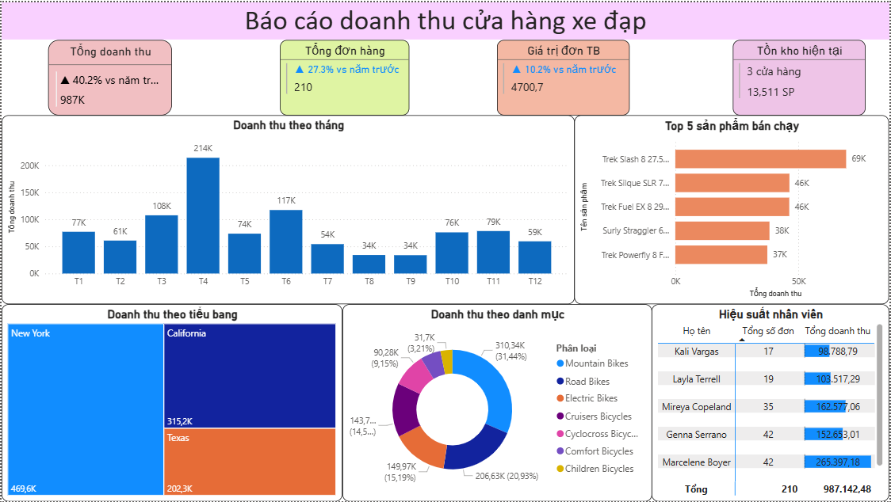
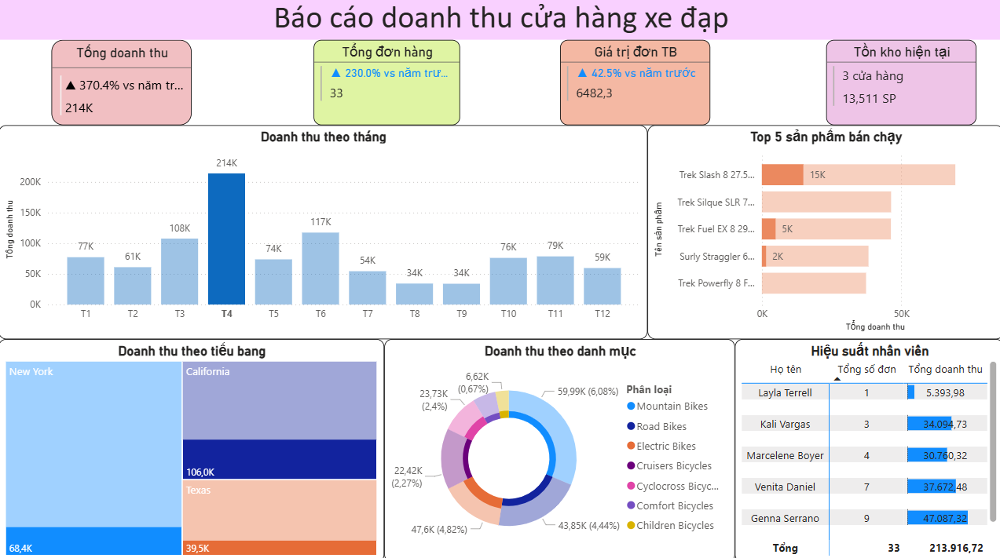
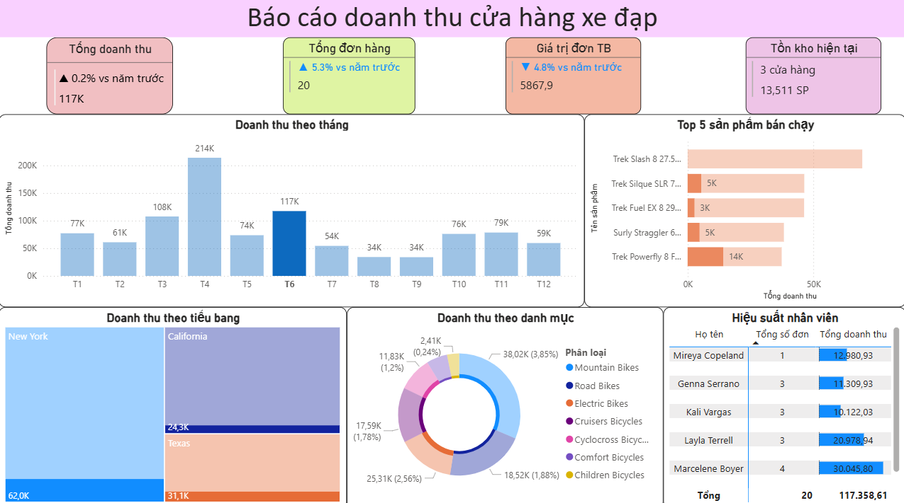

# 🚲 Bicycle Store Sales Dashboard

## 📌 Giới thiệu
Xây dựng hệ thống báo cáo end-to-end cho chuỗi cửa hàng xe đạp
Thiết kế database theo Galaxy Schema, xây dựng ETL pipeline xử lý và chuẩn hóa dữ liệu bằng SSIS
Phân tích doanh thu theo tháng, tiểu bang, danh mục sản phẩm và hiệu suất nhân viên trên Power BI

> ⚠️ Data trong project này là data mẫu tự tạo cho mục đích học tập.

## 🛠 Tech Stack
| Layer              | Tool       |
-----------------------------------
| Storage & Modeling | SQL Server |
| ETL Pipeline       | SSIS       |
| Visualization      | Power BI   |

## 🔄 Pipeline
SQL Server → SSIS (ETL) → Power BI

## 🗄 Database Schema

## 🔧 SSIS ETL Pipeline

### Control Flow

### Data Flow - Staging

### Data Flow - Transform

### Data Flow - Load Dimension

### Data Flow - Load Fact

## 📊 Dashboard

